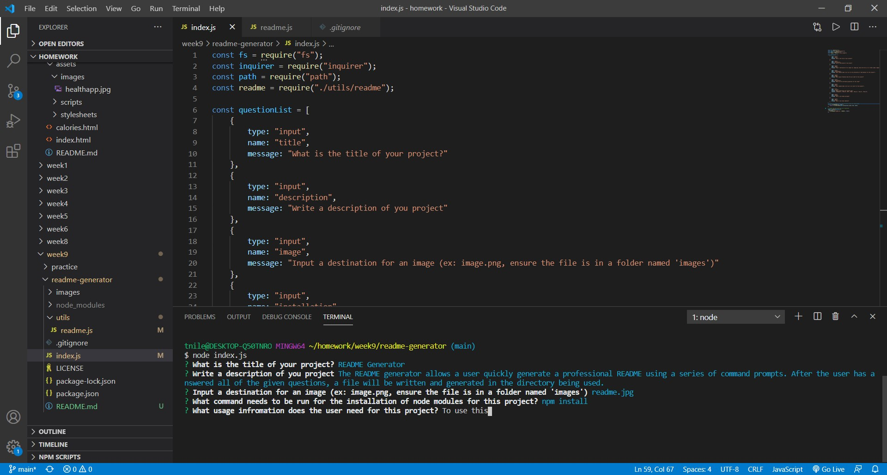

# README Generator

## Description

The README generator allows a user quickly generate a professional README using a series of command prompts. After the user has answered all of the given questions, a file will be written and generated in the directory being used.

## Table of Contents 

* [Installation](#installation)

* [Usage](#usage)

* [License](#license)

* [Contribution Guidelines](#contribution-guidelines)

* [Tests](#tests)

* [Questions](#questions)

## Installation

Run the following command to install node modules:

_npm install_

## Usage

To use this application run the index.js file in the terminal and answer a series of prompts.

## License

This project is licensed under MIT

## Contribution Guidelines

Currently there are no contribution guidelines for this repo.

## Tests

Run the following command in the terminal to run tests:

_There are currently no test files for this application._

## Questions

If you have any questions regarding this repo, you may contact me at tniles320@gmail.com. To see my other work, follow this link: [GitHub](https://github.com/tniles320/).